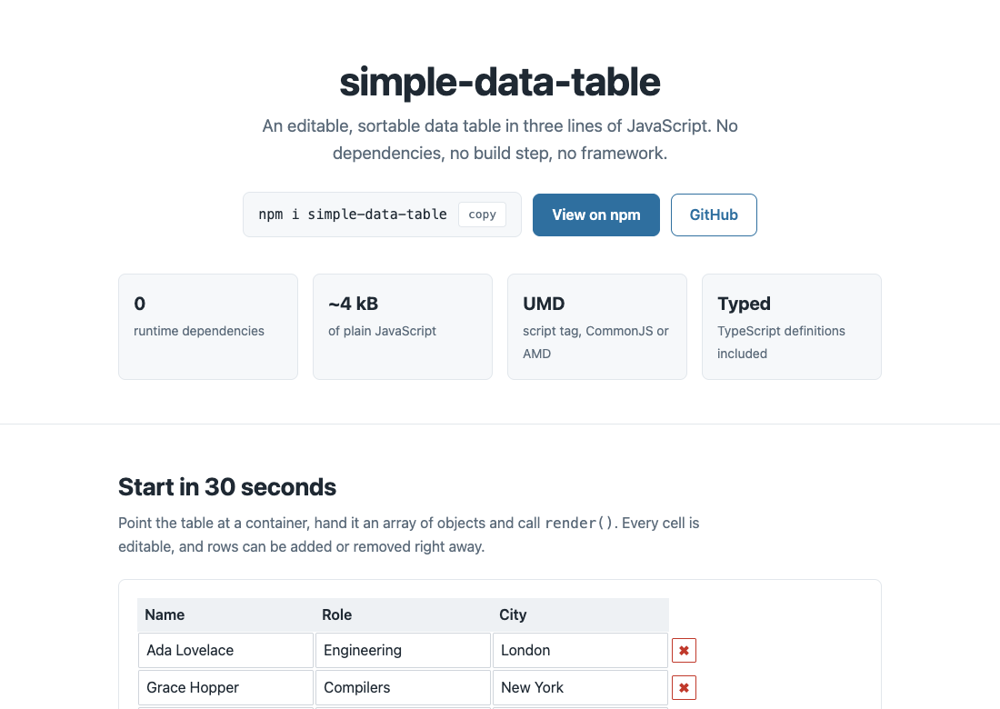

# simple-data-table

<!-- prettier-ignore-start -->

[](https://www.npmjs.com/package/simple-data-table)
[](https://badge.fury.io/js/simple-data-table)
[](https://www.npmjs.com/package/simple-data-table)
[](https://packagephobia.com/result?p=simple-data-table)
[](https://piecioshka.mit-license.org)
[](https://github.com/piecioshka/simple-data-table/actions/workflows/testing.yml)

<!-- prettier-ignore-end -->

🔨 Lightweight and simple data table with no dependencies

## Preview 🎉

<https://piecioshka.github.io/simple-data-table/demo/>



To run the demo locally (it starts on the first free port from 3000 up):

```bash
npm run demo
```

## Features

- 📦 No dependencies, no build step _(a single `<script>` tag is enough)_
- 🪶 Tiny package _(~4 kB of plain JavaScript)_
- 🔌 Works as ES module, UMD, CommonJS or AMD module
- 📊 Display any data (array with objects) in simple table layout
- ✏️ Edit cells, add and remove rows out of the box
- 🔀 Smart sorting _(numbers as numbers, ISO dates chronologically, text in natural order, empty values last)_
- 🧮 Custom comparing function for full control over sorting (`setSortComparingFn()`)
- 📡 Custom events for updated cells, added and removed rows and sorting (`on()`, `emit()`)
- 🎨 Two skins included _(light `default.css` and dark `midnight.css`)_
- 🖌️ Support custom skins _(style children of `div.simple-data-table`)_
- 🔒 Readonly mode _(disabled inputs, no add and remove buttons)_
- 🛡️ Your data is never mutated _(rows are copied on `load()`)_
- 📘 TypeScript definitions included
- ⛓️ Fluent API _(not available in all public methods)_
- ♿ Keyboard accessible _(visible focus ring on inputs and buttons)_

## Usage

Installation:

```bash
npm install simple-data-table
```

```html
<link
    rel="stylesheet"
    href="node_modules/simple-data-table/src/skins/default.css"
/>
<script src="node_modules/simple-data-table/src/index.js"></script>
```

```javascript
const $container = document.querySelector('#place-to-render');
const options = {/* all available options are described below */};
const t = new SimpleDataTable($container, options);
t.load([
    {
        column1: 'Cell 1',
        column2: 'Cell 2',
        column3: 'Cell 3',
    },
    {
        column1: 'Cell 4',
        column2: 'Cell 5',
        column3: 'Cell 6',
    },
    {
        column1: 'Cell 7',
        column2: 'Cell 8',
        column3: 'Cell 9',
    },
    {
        column1: 'Cell 10',
        column2: 'Cell 11',
        column3: 'Cell 12',
    },
]);
t.render();
```

### ES modules

The package also ships an ES module entry point, so `import` works with a bundler and in Node:

```javascript
import { SimpleDataTable } from 'simple-data-table';
// a default export is available too:
// import SimpleDataTable from 'simple-data-table';
```

Straight from a browser, without a bundler, point the import at the file itself:

```html
<script type="module">
    import { SimpleDataTable } from './node_modules/simple-data-table/src/index.mjs';
</script>
```

## Skins

The package ships two stylesheets:

```html
<!-- light, used by default -->
<link
    rel="stylesheet"
    href="node_modules/simple-data-table/src/skins/default.css"
/>

<!-- optional dark skin -->
<link
    rel="stylesheet"
    href="node_modules/simple-data-table/src/skins/midnight.css"
/>
```

The dark skin is opt-in, so it never overrides your own styles. Add the `midnight` class to the wrapper after rendering:

```js
t.render();
$container.querySelector('.simple-data-table').classList.add('midnight');
```

## Options

#### `addButtonLabel` _(Default: '✚')_

Change the label of the button which adds a new row.

```js
const t = new SimpleDataTable($container, {
    addButtonLabel: 'New record'
});
t.load(...);
t.render();
```

#### `defaultColumnPrefix` _(Default: 'column')_

Define the "name" prefix of cells in newly added columns.

```js
const t = new SimpleDataTable($container, {
    defaultColumnPrefix: 'random'
});
t.load(...);
t.render();
```

#### `defaultColumnNumber` _(Default: null)_

Define how many columns a new row should contain in an empty table.

By default, the number of headers or the number of cells in the first row of data is used.

```js
const t = new SimpleDataTable($container, {
    defaultColumnNumber: 7
});
t.load(...);
t.render();
```

#### `defaultHighlightedCellClass` _(Default: 'highlighted-cell')_

Define class of highlighted cell.

```js
const t = new SimpleDataTable($container, {
    defaultHighlightedCellClass: 'my-highlight'
});
t.load(...);
t.render();
```

#### `readonly` _(Default: false)_

Disable editing: inputs are disabled and rows cannot be added or removed.

```js
const t = new SimpleDataTable($container, {
    readonly: true
});
t.load(...);
t.render();
```

## API

**NOTE**: Methods which read from the DOM (`getRowsCount`, `findCellsByContent`, `getCell`, `highlightCell`, `clearHighlightedCells`, `setInputCellContent`) require calling `render()` first.

#### `render(): SimpleDataTable`

Render table into DOM.

#### `getRowsCount(): number`

Get number of rows.

#### `findCellsByContent( ...content: Array<string> ): Array<{ rowIndex: number, cellIndex: number }>`

Get list of cell positions which contains passed strings.

#### `getCell( rowIndex: number, cellIndex: number ): HTMLElement | null`

Get DOM reference of concrete cell.

#### `highlightCell( rowIndex: number, cellIndex: number )`

Add class to concrete cell.

#### `clearHighlightedCells()`

Remove CSS class of all highlighted cells.

#### `setInputCellContent( rowIndex: number, cellIndex: number, content: string )`

Put content into input in concrete cell.

#### `setHeaders( items: Array<string> )`

Setup column headers. Sorting is enabled by default.

#### `load( data: Array<object> )`

Loading data into table component. Rows are copied, so editing cells never mutates the objects passed in.

#### `emit( name: string, payload: any )`

Trigger event on SimpleDataTable instance.

#### `on( name: string, handler: Function )`

Listen on events.

#### `sortByColumn( columnIndex: number )`

Sorts data and triggers `DATA_SORTED` event.

**WARNING**: Function `sortByColumn()` runs `render()` under the hood.

#### `setSortComparingFn( fn: (val1, val2) => number )`

Replace the default comparing function. Empty values are handled before the function is called, so it never receives `null`, `undefined` or `''`.

#### `SimpleDataTable.compareValues( val1, val2 ): number`

Default comparing function, which picks a strategy from the value types:

- **numbers** (also numeric strings like `'10'`) are compared numerically, so `2` comes before `10`
- **ISO dates** (`2026-01-05`, `2026-01-05T12:00:00Z`) are compared chronologically
- **anything else** is compared as text with natural ordering, so `item2` comes before `item10`

Empty values (`null`, `undefined`, `''`) always sink to the bottom, regardless of the sort direction.

#### `SimpleDataTable.isEmptyValue( value ): boolean`

Checks whether a value is treated as empty by the sorting logic.

## Events

#### `SimpleDataTable.EVENTS.UPDATE`

Event is dispatching when you change any of input in table.

```js
const t = new SimpleDataTable($container);
t.on(SimpleDataTable.EVENTS.UPDATE, (data) => {
    // do some stuff with the updated data...
});
```

#### `SimpleDataTable.EVENTS.ROW_ADDED`

Event is dispatching when you add new record.

```js
const t = new SimpleDataTable($container);
t.on(SimpleDataTable.EVENTS.ROW_ADDED, () => {
    // do some stuff...
});
```

#### `SimpleDataTable.EVENTS.ROW_REMOVED`

Event is dispatching when you remove any record.

```js
const t = new SimpleDataTable($container);
t.on(SimpleDataTable.EVENTS.ROW_REMOVED, () => {
    // do some stuff...
});
```

#### `SimpleDataTable.EVENTS.DATA_SORTED`

Event is dispatching after data is sorted with `sortByColumn` function.

```js
const t = new SimpleDataTable($container);
t.on(SimpleDataTable.EVENTS.DATA_SORTED, () => {
    // do some stuff...
});
```

## Static

#### `SimpleDataTable.clearElement( $element: HTMLElement )`

Recursive remove children from passed HTMLElement.

## License

[The MIT License](https://piecioshka.mit-license.org) @ 2026
